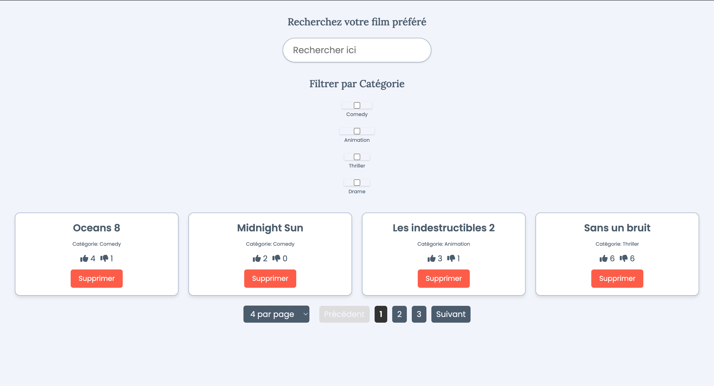

# Projet Frontend - Listing de Vidéos

## Description
Ce projet liste des films avec une interface utilisateur réactive. Les utilisateurs peuvent filtrer par catégorie, aimer/détester les films, supprimer des cartes de films, et naviguer à travers les pages.

## Installation
1. Clonez le dépôt :

   git clone [URL_DU_DEPOT]

2. Accédez au répertoire du projet :

cd Listing

3. Installez les dépendances :

npm install

## Exécution
1. Lancez le serveur de développement :

npm start

2. Ouvrez http://localhost:3000 dans votre navigateur.

## Fonctionnalités

- Liste des films avec filtre par catégorie
- Boutons pour aimer/détester et supprimer les films
- Pagination et choix du nombre d'éléments par page

